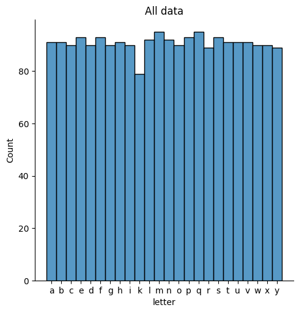
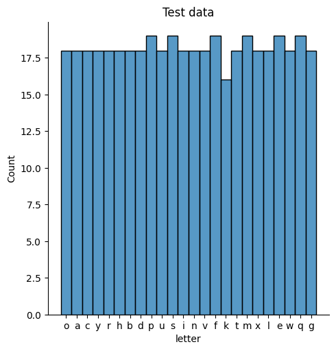
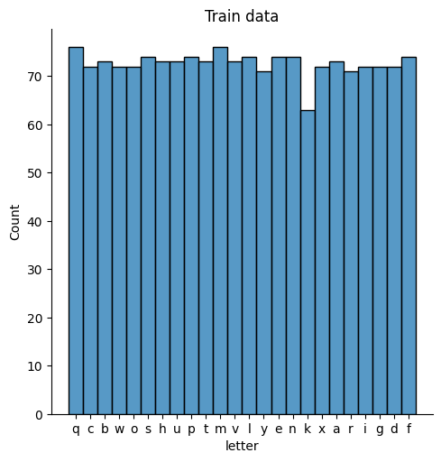

# Hand signs recognition project
Project is dedicated to recognizing hand signs with simple machine learning application.

# Preparing data
While preparing first data batch for training `lookup_data.ipynb` notebook was created to fastly look into some details concerning simple data processing and vizualization. While using notebook some of the things were observed. First was data distribution of features in dataset:

# Model selection
Model that were tried during testing phase:
- VotingClassifier,
- MLPClassifier, 
- MLPRegressor, 
- DecisionTreeClassifier,
- LinearSVC,
- KNeighborsClassifier,
- MLPClassifier,
- MLPRegressor,
- SVR,
- SVC,
- DecisionTreeRegressor,
- BaggingClassifier,
- AdaBoostClassifier,
- QuadraticDiscriminantAnalysis
- ExtraTreesClassifier.

Voting classifier as well as other ensemble classifiers were tested, the same goes for boost classifiers.

## Currently best implemented solution:
Current best solution is consisting of voting classifiers consisting of QuadraticDiscriminantAnalysisClassifier and neural network tuned for application. This model currently has 95.6% accuracy score

# Test results
The best combination of classifiers was:
- Using VotingClassifier with QuadraticDiscriminantAnalysis and MLPClassifier
- The reason is that they compliment their Decision boundaries very well
- They also fit altogether into data way better than any other used combination even when trying 3 or 4 different ensembled classifiers

