# Hand signs recognition project
Project is dedicated to recognizing hand signs with simple machine learning application.

# Preparing data
While preparing first data batch for training `lookup_data.ipynb` notebook was created to fastly look into some details concerning simple data processing and vizualization. While using notebook some of the things were observed. First was data distribution of features in dataset:

## Data distribution for letters
Data was also experimented on based on how to fit decision boundaries into features. Visualization was a challenge and method selected for visualization was to calculate means of every x, y, z coordinate and then plot it accordingly on the plot trying to look what type of fingerpoints are more informative then the others. But prior to that boxsplots were plotted to check if data can be approximated in some way by using mean value. 

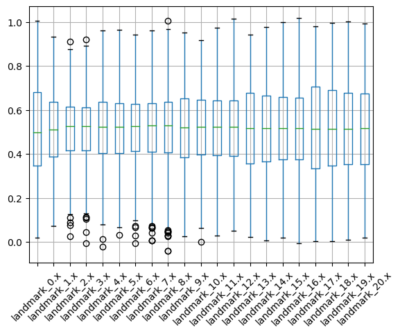
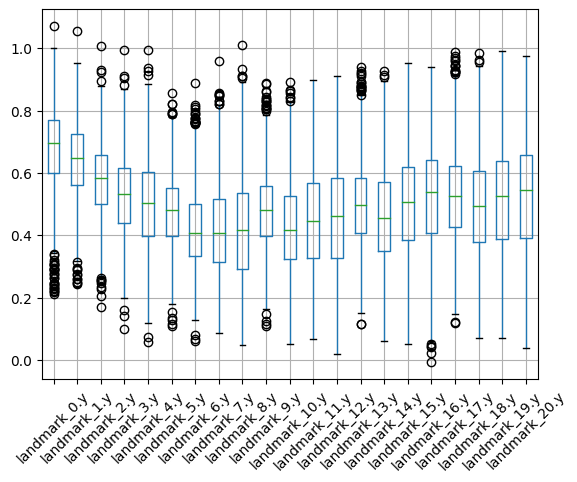
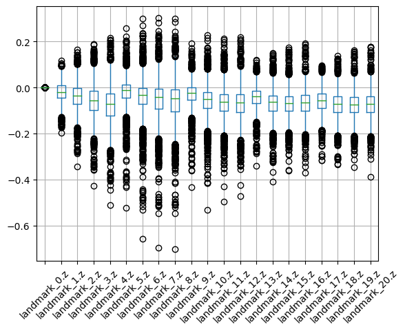

As can be seen above data x and y is not having many as many outliers and z data which cannot really be approximated by mean value. Afterwards using mean values data was displayed in scatterplot in 3d to check if it can be clustered properly for each letter. First goal was to visualize data in 3d with and without z to display if hypothesis set before can be used.

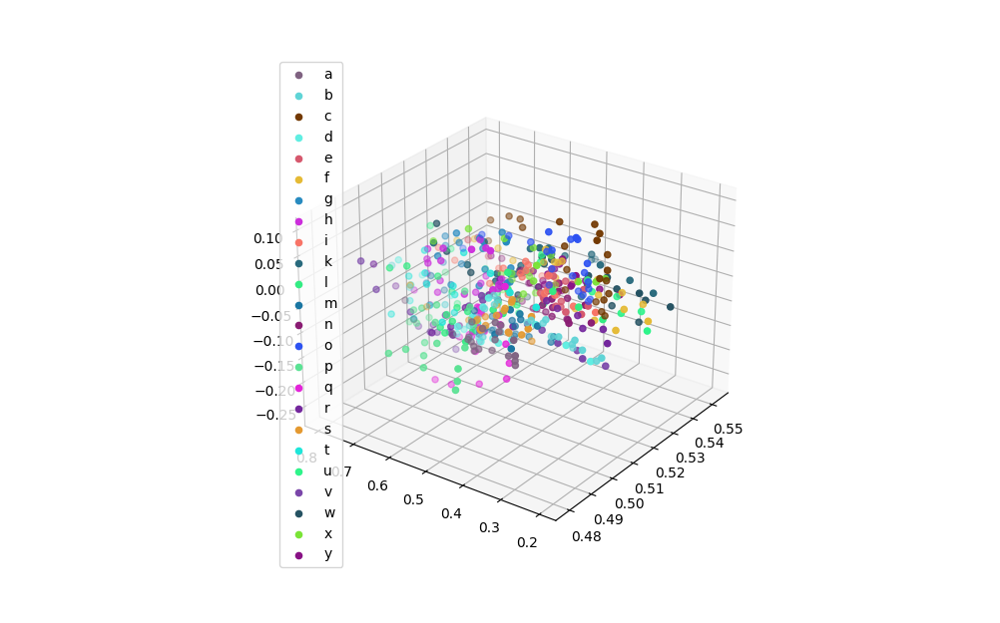
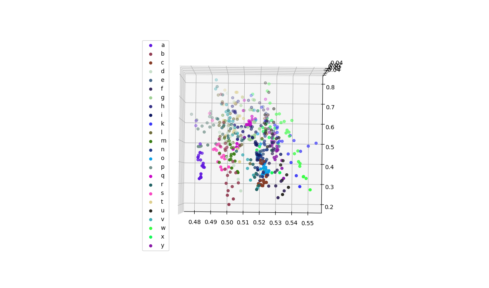

Data can be seen as to clustered together this way with too many features mixed up together so next decision was to display data in 3d for each of one finger keypoint of the same category such as: 
- MCP
- PIP
- TIP
- DIP

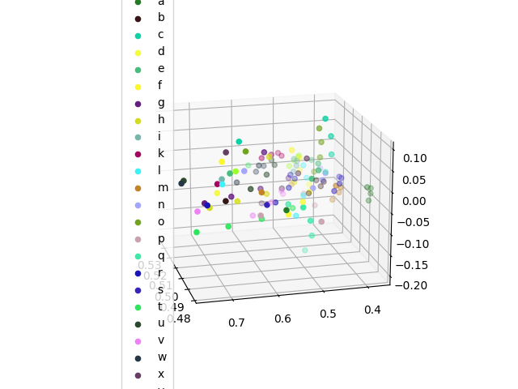
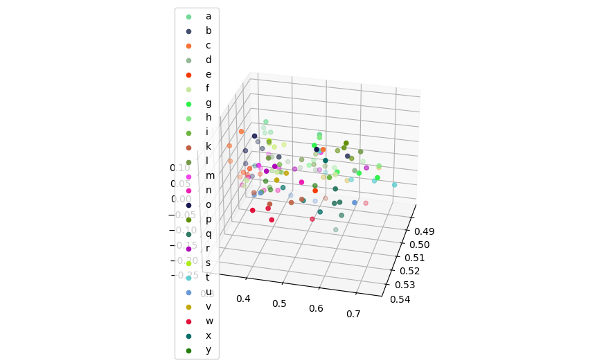
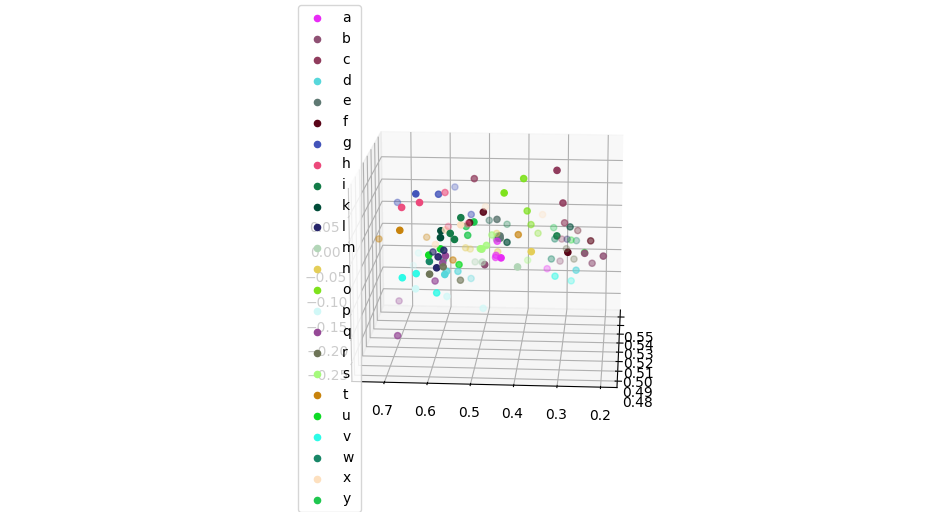
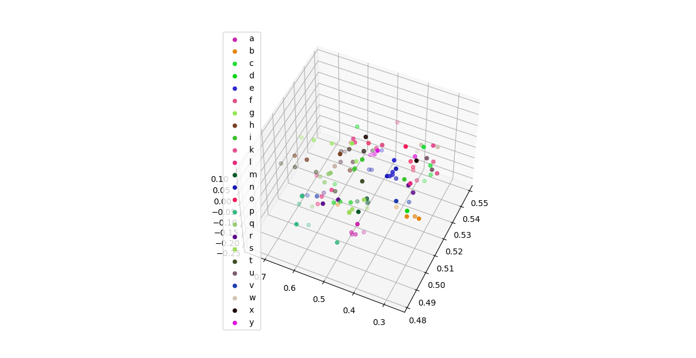

As can be seen on images above DIP data is the only one that is hard too cluster together because of many features crossing many possible boundries. Also data is not as informative as the TIP data so decision is to drop data from training dataset completly. Another observable fact is huge disparity between z data across the board. This fact leads to hard information extraction overall because of many outliers clustered together. This problem is hard to solve by tuning model so data will be dropped completely aside for the fingertips Z data that is very influential to some letters detection such as `a`, `m`, `n`, in which fingers are displayed to the front of palm.

# Model selection
Model that were tried during testing phase:
- VotingClassifier,
- MLPClassifier, 
- MLPRegressor, 
- DecisionTreeClassifier,
- LinearSVC,
- KNeighborsClassifier,
- MLPClassifier,
- MLPRegressor,
- SVR,
- SVC,
- DecisionTreeRegressor,
- BaggingClassifier,
- AdaBoostClassifier,
- QuadraticDiscriminantAnalysis
- ExtraTreesClassifier.

Voting classifier as well as other ensemble classifiers were tested, the same goes for boost classifiers.

## Currently best implemented solution:
Current best solution is consisting of voting classifiers consisting of QuadraticDiscriminantAnalysisClassifier and neural network tuned for application. This model currently has 95.6% accuracy score

# Test results
The best combination of classifiers was:
- Using VotingClassifier with QuadraticDiscriminantAnalysis and MLPClassifier
- The reason is that they compliment their Decision boundaries very well
- They also fit altogether into data way better than any other used combination even when trying 3 or 4 different ensembled classifiers

Some of the major things to mention in terms of every step of implementation is listed below. Every single one is using voting classifier

## First model created with 81% accuracy

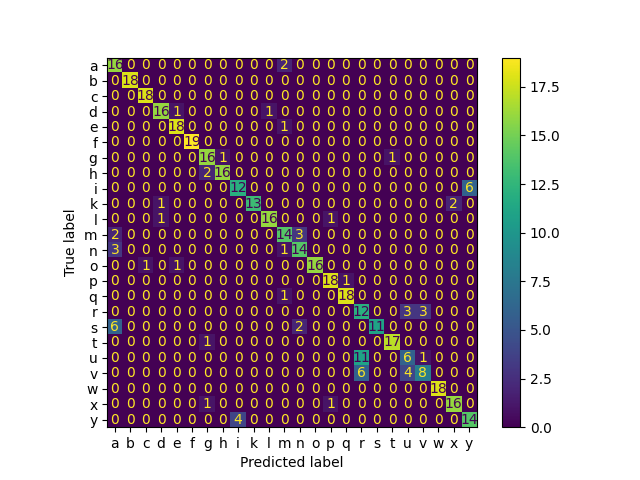

As seen on graphic above matrix displays high error in terms of identifing `u` and `v` letter which is was very problematic and has dedicated segment of experimentation in notebook. Implementation consists of `Voting classifier` with `MLPClassifier` and `Decision tree`.

## Second model created with 91% Accuracy 

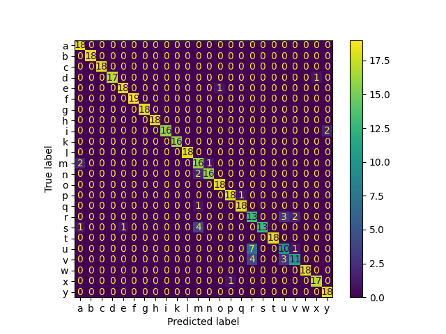

As seen on graphic above matrix displays high error in terms of identifing `u` and `v` which is the same problem as above but not as extensive because error was sucessfully reduced. The problem still heavily persists which means that additional implementation of `Voting classifier` with `MLPClassifier` and `Polyminal SVC`. This means that problem cannot be solved via extending decision boundaries in *square like shapes* as in case of decision tree and some other classifier such as SVC, KNClassifier or QDA should be a huge help.

## Final model with 96% accuracy score

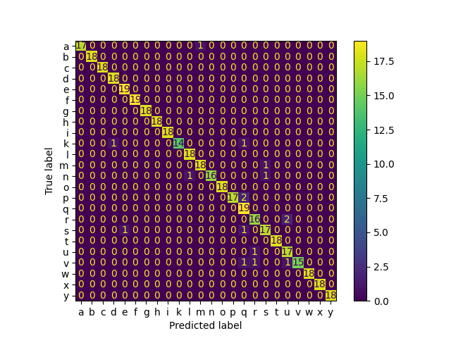

Error is successfully reduced and is not as big problem as previosly. Modification made is adding `QuadraticDiscriminantAnalysis` to voting classifier. This allowed to heavily reduce influence of previously wrongly detected `u` and `v` to very big extent.
